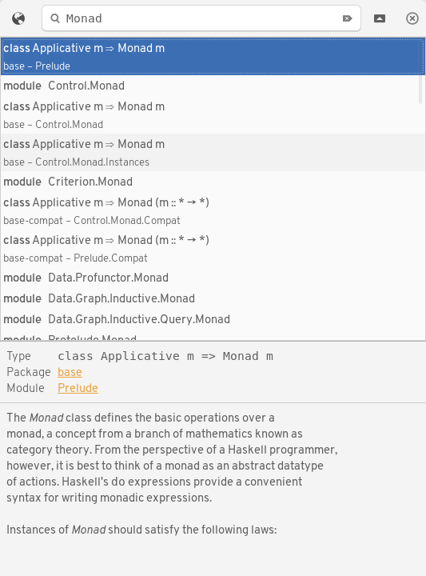

# Hoogle GTK

**hoogle-gtk** is a simple GTK wrapper around [hoogle](https://hackage.haskell.org/package/hoogle).

## Features

* Full Hoogle search
* Horizontal and vertical mode
* Open full package/module/function documentation in browser
* Follows GNOME HIG

## Build

For the time being, this package requires the GitHub version of
[reactive-banana-gi-gtk](https://github.com/mr/reactive-banana-gi-gtk), because
of restrictive upper bounds on the Hackage version. The included stack
configuration should build it fine.

    stack install

A .desktop file is provided in the `res` directory.
